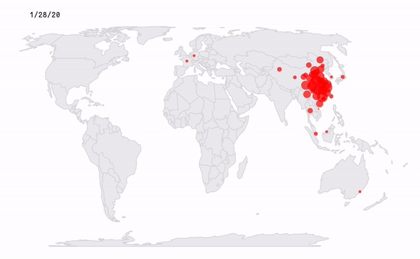

### 2019-nCOV disease map visualization since 22 January 2020.

## [disease.now.sh](https://disease.now.sh)

Data from [CSSEGISandData/COVID-19](https://github.com/CSSEGISandData/COVID-19).

Thanks [@pascalwhoop](http://github.com/pascalwhoop) for converting the JSON file to a REST API ([#295](https://github.com/CSSEGISandData/COVID-19/issues/295))
